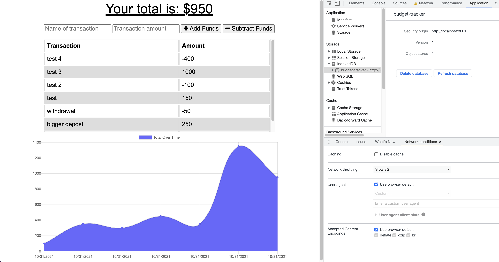

# budget-tracker
# Budget Tracker

 ## Table of contents
* [Installation](#installation)
* [Usage](#usage)
* [Credits](#credits)
* [License](#license)

---
## Description

  This is a web based application that tracks your budget by adding and subtracting deposits and widrawels 

## Installation
  run npm install to install the dependancies. Then run node server to start it on your local host

## Usage
  

  ---

## Deployed Link
  https://serene-sea-47708.herokuapp.com/

  ### Have any questions or concerns? Contact me!
https://github.com/snowden421/budget-tracker

  ---
### License
  https://opensource.org/licenses/MIT

